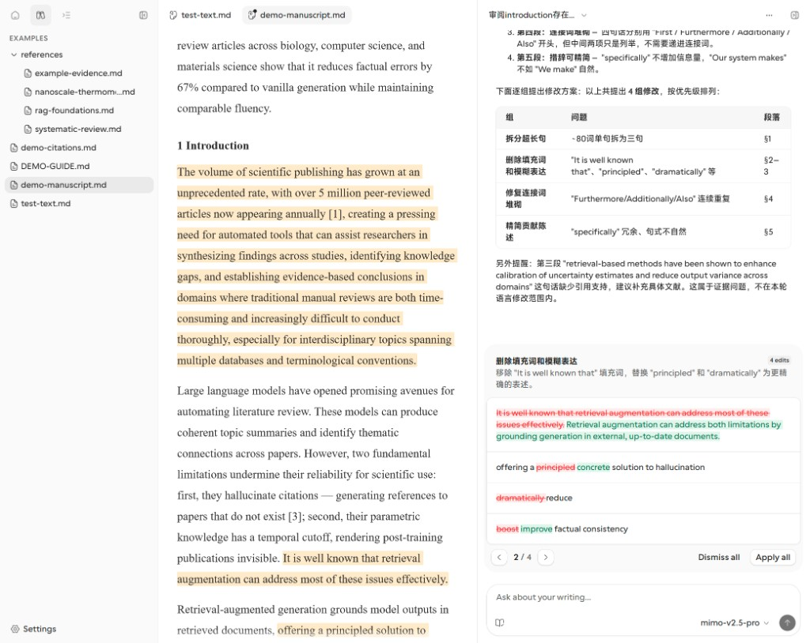

# Writing Agent

面向学术与技术写作的 AI 协作编辑器——所有修改经审阅后再落盘。

Agent **提议**结构化编辑 → 后端**验证** → 你在 Review Queue **审阅**并 Accept / Dismiss。文档在你确认前不会被改写。



## 核心功能

### 可控编辑

结构化 Edit Group + diff 预览，逐组 Apply / Dismiss（见上图）。

### 可验证质量

- **引用检查**：校验 DOI / URL 可达性，并与本地 `references/` 对照
- **读者诊断**：可选 Auto Review，先诊断再修改

### 可积累偏好

从 Accept / Reject / 调整中学习；`propose_principle` 提议的原则需在 Settings → Memory 中确认后生效。

### 跨会话上下文

`remember_context` 持久化读者画像、术语与项目常识，跨会话自动注入。

## 快速开始

**Requires:** Node.js ≥ 18、pnpm、Python ≥ 3.11、[uv](https://docs.astral.sh/uv/)、OpenAI 兼容 API key。

```bash
cp .env.example .env
cp tools.yaml.example tools.yaml
cp subagents.yaml.example subagents.yaml
cp models.yaml.example models.yaml

npm install
cd frontend && pnpm install && cd ..
npm run dev                   # Agent :8765 + 前端 :5173
```

打开 http://localhost:5173 ，默认工作区：`examples/`。

## 文档

- [设计原则](docs/principle.md)
- [演示场景](examples/DEMO-GUIDE.md)
- [后端结构](agent/README.md)

## 开发

```bash
cd agent && uv run pytest -q && uv run python -m evals.runner --suite smoke
cd ../frontend && pnpm run build
```
